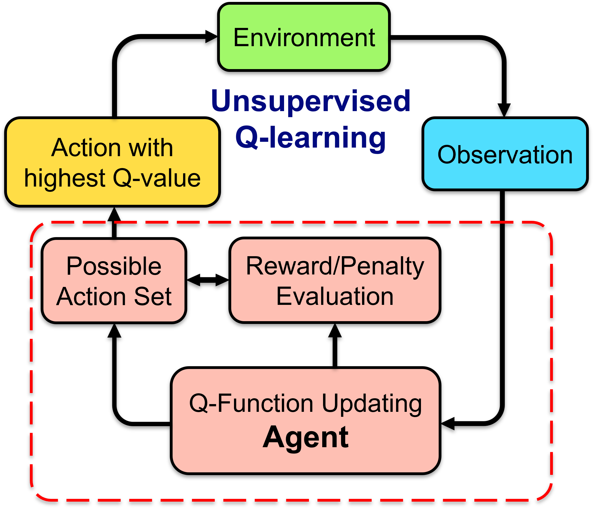
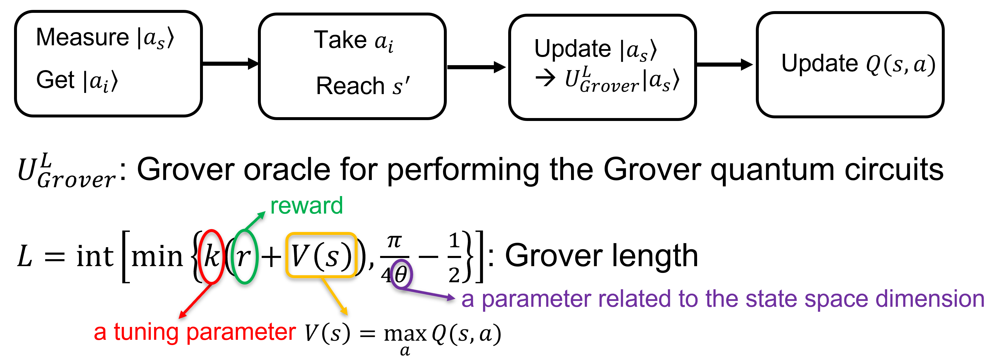
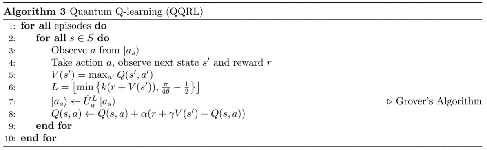
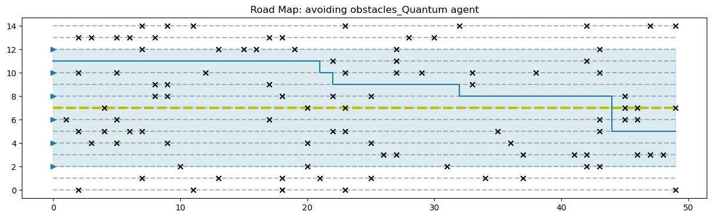

# GroverQLearning
## Introduction
The GroverQLearning is a reinforcement learning with a quantum agent that implements the Grover's algorithm. In this project, we adopt the widely used reinforcement Q-learning algorithm which has the following architecture:

 

The key step in this Q-learning is to update a so-called Q-function which takes a state-action pair as its argument, namely $Q(s,a)$. The update rule is the following
$$Q(s,a)\leftarrow (1-\alpha)Q(s,a) + \alpha\left(r(s,a)+\gamma \max_{a'}Q(s,a')\right)$$
where $\alpha$ is the learning rate, $r(s,a)$ is the reward or penalty for taking action $a$ at state $s$, and $\gamma$ is a discount factor for convergence. The meaning of the Q-function is the expectation of total reward after taking action $a$ at state $s$. So, the goal is to learn the Q-function such that a good action gives high Q-value for a given state.
 
 
What an agent needs to do is that, given a Q-function, it should observe the environment and choose an action to perform then update the Q-function based on the reward it gets. There are many ways to implement this agent. A simple classical agent would be a search algorithm directly searching for the action that maximizes the Q-function for a given state. In this project, we instead use the quantum search algorithm called [Grover's algorithm](https://en.wikipedia.org/wiki/Grover%27s_algorithm) to do the job. The basic idea is to first encode the actions for a given state $s$ into a quantum state $|a_s\rangle$ and to update it using Grover iterations, which looks like

 

The Grover length $L$ is how many iterations we need to perform the Grover oracle, which is related to the reward and the learned Q-function.

## Implement Q learning algorithms based on the Grover algorithm
We adopt the algorithm from Ref. [1] which reads

 

but with some modifications. The update of the V-values requires a search for maximal values in Q-function. To avoid that, we directly update $V(s)$ using $Q(s,a)$ with $|a\rangle$ being the measured results when given state $s$. The quantum mechanics ensure us with high possibilities to get $\max_{a}Q(s,a)$.
 
 
More information can be found in the [project report](./Resources/Grover_Method_for_Quantum_Reinforcement_Learning.pdf).

## Package installation and examples

### 1. Install the package qrllearner and its dependencies  
In terminal, type:  
~~~python
pip install qrllearner
pip install numpy
pip install matplotlib
pip install qiskit
~~~
Source code: [QQL_learner_trainer.py](./QLearning_Agent/QQL_learner_trainer.py)

### 2. Train the Grover agent with the FrozenLake environment with gym  
Install the gym package by typing the following command in terminal.
~~~python
pip install gym
~~~ 

Run the following code in a python notebook:
~~~python
import numpy as np
import matplotlib.pyplot as plt
import gym
from qrllearner import GroverQlearner

# setup FrozenLake environment
env = gym.make("FrozenLake-v1", is_slippery=False, render_mode="ansi")

# create GroverQlearner object as the agent
QuanAgent = GroverQlearner(env,env_type='global')

# set hyperparameters for training
hyperp = {'k': 0.1,
          'alpha': 0.1,
          'gamma': 0.99,
          'eps': 0.01,
          'max_epochs': 3000,
          'max_steps': 15}

QuanAgent.set_hyperparams(hyperp)

# train model
steps_vs_epochs,target_reached_vs_epochs,_ = QuanAgent.train()

# plot step vs epoch
plt.plot(steps_vs_epochs)
plt.xlabel('Epoch')
plt.ylabel('Steps')
plt.show()
# plot target reached vs epoch
plt.scatter(range(len(target_reached_vs_epochs)),target_reached_vs_epochs)
plt.xlabel('Epoch')
plt.ylabel('Target Reached')
plt.show()
~~~

 
### 3. Train the Grover agent with the custome sidewalk environment  
Install the custom sidewalk environment: 
~~~python
pip install sidewalkdemo
~~~
Source code: [SideWalkEnv.py](./sidewalk_env/SideWalkEnv.py)  
Run the following code in a python notebook
~~~python
import matplotlib.pyplot as plt
import numpy as np
from qrllearner import GroverQlearner
from sidewalkdemo import *

# set up and visualize the road map
env = side_walk_env_with_obstacle(50,15,12,2,0.2)
# env.plot_roadmap()

QuanAgent = GroverQlearner(env,env_type='local')
hyperp = {'k': 0.1,
          'alpha': 0.1,
          'gamma': 0.8,
          'eps': 0.01,
          'max_epochs': 800,
          'max_steps': 300}

# set hyperparms
QuanAgent.set_hyperparams(hyperp)
# TRAIN
steps_in_all_epochs,target_reached_in_all_epochs,_ = QuanAgent.train()

# print(Elliot.Q_values)

# plot the trajectory after training
env_with_obstacle_test = side_walk_env_with_obstacle(p_obstacle=0.15)
trajectory = env_with_obstacle_test.trajectory(QuanAgent.Q_values)
env_with_obstacle_test.plot_roadmap_with_trajectory('avoiding obstacles_Quantum agent',trajectory)
~~~

The above example shows a special task for avoiding obstacles when going through the sidewalk. We also provide another task for picking up litters along the sidewalk. Examples can be found in file [QLearning_sidewalk_picking_up_litters_quantum_agent.ipynb](./sidewalk_env/QLearning_sidewalk_picking_up_litters_quantum_agent.ipynb)

### 4. Comparison with a classical Q-learner
In package qrllearner, we also provide a classical learner class called `ClassicalLearner` with the same api. Run above examples by simply replacing `GroverQlearner` with `ClassicalLearner`. However, the hyperparameters for the classical learner is different from those for the Grover learner. Fine tunning is needed to get better performence.

[1]: [Ganger, M. and Hu, W. International Journal of Intelligence Science, 9, 1-22 (2019)](https://www.scirp.org/html/1-1680231_89926.htm) 
