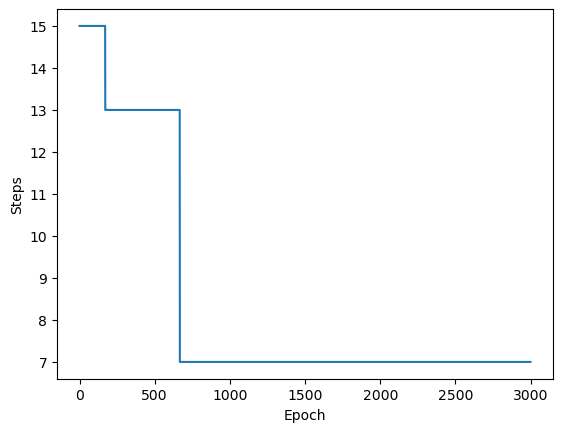
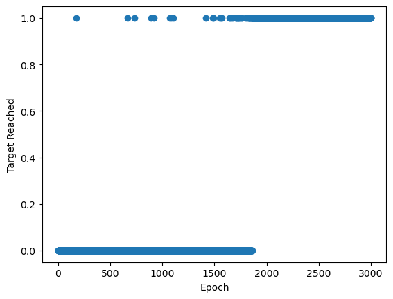

# GroverQLearning
Implement Q learning algorithms based on the Grover algorithm

1. Install the package qrllearner and its dependency qiskit  
In terminal, type:  
~~~
pip install qrllearner
pip install qiskit
~~~

2. Train the Grover agent with the FrozenLake environment with gym  
Install the gym package by typing the following command in terminal.
~~~
pip install gym
~~~ 

Run the following code in a python notebook:
~~~
import numpy as np
import matplotlib.pyplot as plt
import gym
from qrllearner import GroverQlearner

# setup FrozenLake environment
envtest = gym.make("FrozenLake-v1", is_slippery=False, render_mode="ansi")

# create GroverQlearner object as the agent
Elliot = GroverQlearner(envtest)

# set hyperparameters for training
hyperp = {'k': 0.1,
          'alpha': 0.1,
          'gamma': 0.99,
          'eps': 0.01,
          'max_epochs': 3000,
          'max_steps': 15}

Elliot.set_hyperparams(hyperp)

# train model
steps_in_all_epochs,target_reached_in_all_epochs,_ = Elliot.train()

# plot step vs epoch
plt.plot(steps_in_all_epochs)
plt.xlabel('Epoch')
plt.ylabel('Steps')
plt.show()
# plot target reached vs epoch
plt.scatter(range(len(target_reached_in_all_epochs)),target_reached_in_all_epochs)
plt.xlabel('Epoch')
plt.ylabel('Target Reached')
plt.show()
~~~

3. Train the Grover agent with the custome sidewalk environment  
install the custom sidewalk environment: 
~~~
pip install sidewalkdemo
~~~
run the following code in a python notebook
~~~
import matplotlib.pyplot as plt
import numpy as np
from qrllearner import GroverQlearner
from sidewalkdemo import *

# set up and visualize the road map
env = side_walk_env_with_obstacle(50,15,12,2,0.2)
env.plot_roadmap()

Elliot = GroverQlearner(env,env_type='local')
hyperp = {'k': 0.1,
          'alpha': 0.1,
          'gamma': 0.8,
          'eps': 0.01,
          'max_epochs': 800,
          'max_steps': 300}

# set hyperparms
Elliot.set_hyperparams(hyperp)
# TRAIN
steps_in_all_epochs,target_reached_in_all_epochs,_ = Elliot.train()

print(Elliot.Q_values)
~~~
